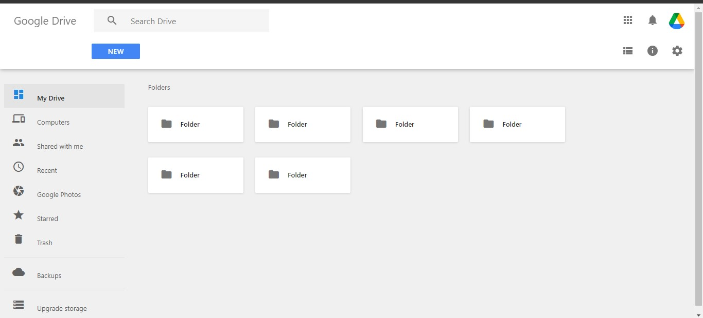

# Google-Drive-Clone
This is just a clone of google drive made using HTML and CSS which i learnt in a web development bootcamp organised by DevTown.

## SCREENSHOTS:

## SOFTWARE USED:
VS CODE

## AUTHOR:
https://github.com/manik-18

## CONTACT:
If any issue is there or you want to give any type of feedback then mail me @guptamanik1810@gmail.com
